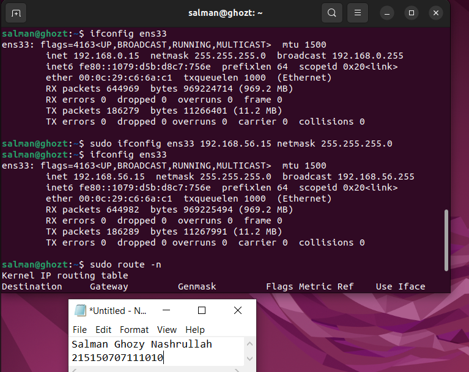

# UAP-ADSIS_215150707111010_Salman-Ghozy-Nashrullah

<h1>Langkah awal</h1>

Pembuatan Repositori baru di GITHUB dengan nama UAP-ADSIS_215150707111010_Salman-Ghozy-Nashrullah

<h1>Langkah pertama</h1>

Buka Ubuntu lewat Vmware dan membuat direktori baru dengan nama UAP-Adsis dan mengganti izin user biasa untuk view-only

<h1>Langkah kedua</h1>

Melakukan konfigurasi alamat IP address sementara pada sistem dan default gateway.
(petunjuk 192.168.56.x | x adalah nomor absen)

<h1>Langkah ketiga</h1>

Melakukan Instalasi Webmin lalu buatlah user bernama nama anda, lalu buat groupAdsis_(kelas masing-masing) dan masukkan nama anda di group

Membuat User dengan nama sendiri

Membuat Group dengan kelas Adsis_E

Memasukkan User ke group kelas yang baru dibuat

<h1>Langkah keempat</h1>

Melakukan ping ke alamat ip anda dan melakukan reject dan drop di webmin

menampilkan peringatan bahwa koneksi lost karena sudah di reject dan drop

Melakukan ping ke alamat yang sudah di reject dan drop

<h1>Langkah kelima</h2>

Membuat perintah otomatis yang berfungsi untuk ping www.filkom.ub.ac.id

Tampilan otomatis ping filkom

